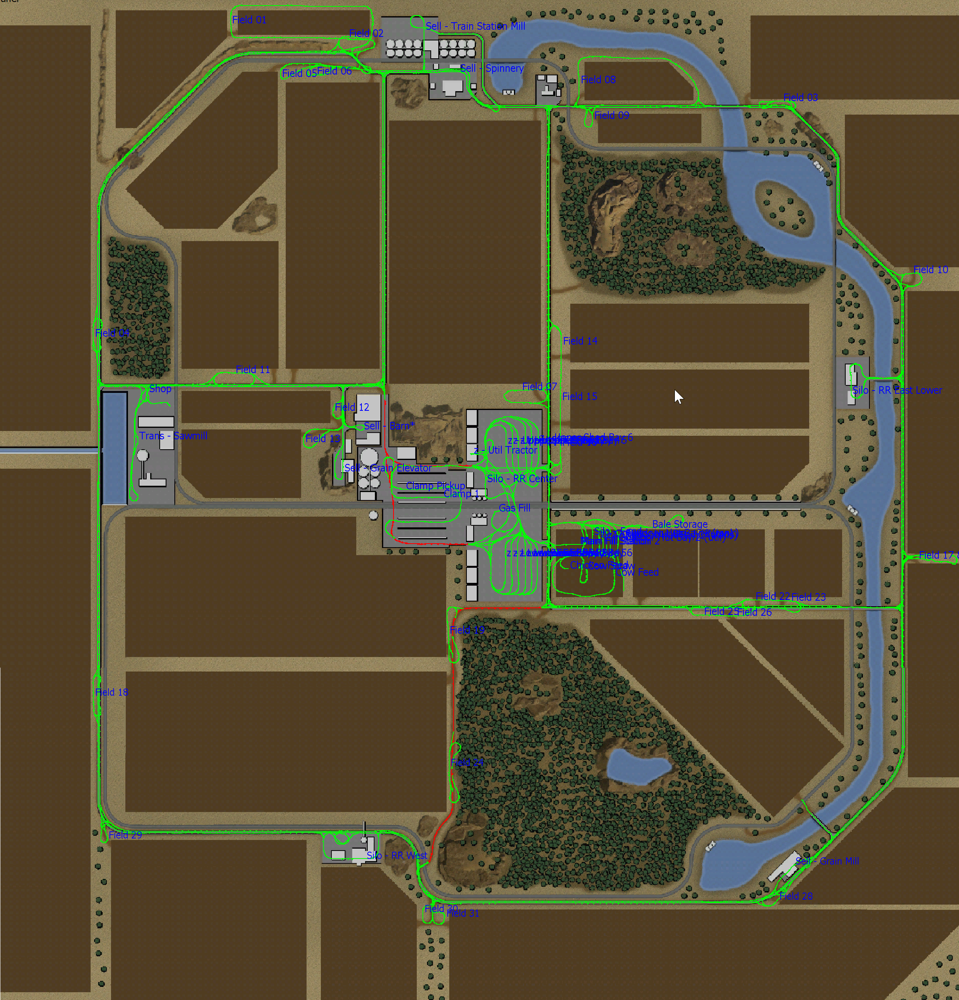

# Map Name

Przema's Outback

## Map Source

Official Modhub

# Route Map Image

# Route Type Preference

All main roads are served with a pair of 1-way routes, to the exception of the dirt path serving Field 19 & 24, which is set to 2-way traffic.

All fields are served 1-way, with adequate turn-arounds for large equipment.

All base sell points are served with paths suitable for large semi trucks.

# Named Destinations

## Fields Served

Fields 1 through 31 (all base fields)

## Pre-Built Silos

 * Railroad Silo West
 * Railroad Silo East (Lower point only)
 * Railroad Silo Center (North only)

## Buy and Sell Points

 * Vehicle Shop
 * Grain Mill
 * Trail Station Mill (point bugged, must use train)
 * Spinnery
 * Central Grain Elevator
 * Barn (close only, not suitable for deliver routes)
 * Sawmill (set closer to transport mission point, not wood sell point)

## BGA Points

 * A single clamp / bunker is configured for pickup/deliver routes.
 
## Non-Standard Structures
 
  * Parking positions in each of the "farm yards" - 6 each.  I use "Large Pull-through Garages" from the modhub.

  * Additional 4 parking spaces, a buy station, silo, and some animal triggers in field 22, which I have repurposed for animal husbandry. Nearby bale storage sheds as well.
