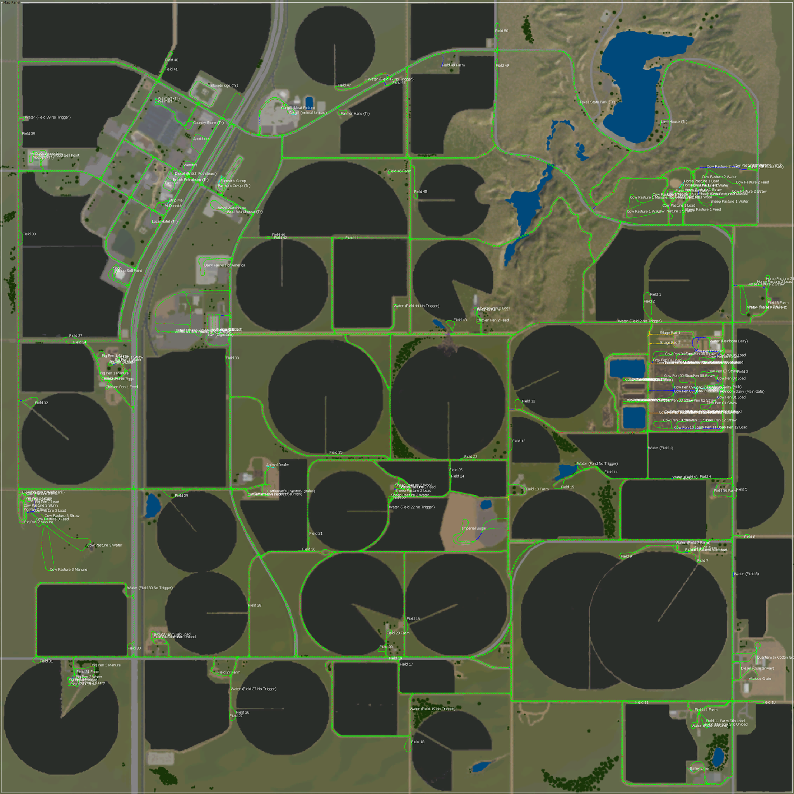

# Map Name

West Texas 2.1.0.2 by The Great Lebowski

## Map Source

Mod-Network
https://mod-network.com/detail/27008/West+Texas+2.1.0.2

Note: There is a [later version](https://mod-network.com/detail/28702/2.1.0.4) of this map on Mod-Network. It changes some of the fields and roads, moves the shop location and requires a new save game. This AutoDrive route may also be useful as a foundation for 2.1.0.4.

## Translations

None available

# Route Map Image

# Route Type Preference

Route map was built in single player using "New Farmer".

Turning standard for all roads and field access is a Lizard Warrior with Wilson Pacesetter trailer. Since this map has collisions on sign posts and telephone poles, the routes will use a wide turn in some cases to allow for a long trailer. Tighter areas such as animal pens have been tested with a small/medium tractor with a smaller trailer such as Kröger Argoliner TKD 302.

Turn on Folders in AutoDrive to make the best use of this route.

# Named Destinations

## Fields Served

All fields 1-50 are served with a one-way drive-through loop, generally in the corner of a the field or for circular fields, near the pivot line.

## Pre-Built Silos

 * Field 07 Farm Silo - Old silo bins. Unload trigger on the ground. Load trigger requires a low trailer and small tractor.
 * Field 11 Farm Silo - Auger silo with small trigger areas for load/unload. Works with TKD 302 with side tip. Load trigger is back-in.
 * Field 28 Farm Silo - Auger silo with small trigger areas for load/unload. Works with TKD 302 with side tip.
 * Farmer's Co-op - Non-functional in this version of the map.
 
## Buy and Sell Points

### Sell Points

 * Animal Dealer - Buy/Sell. Tested with Wilston Silverstar.
 * Applebees
 * Attebuy Grain - Note the sign says Attebury. There is a typo in the sell point listings.
 * Cattleman's Livestock (Bales)
 * Cattleman's Livestock (Crops)
 * Dairy Farmers of America
 * Farmer's Co-op
 * Imperial Sugar
 * McCoy's Wood Sell Point - Manual wood sell trigger.
 * McCoy's Woodchips
 * McDonalds
 * Quarterway Cotton Growers - Tested with Lizard Module X cotton module trailer.
 * Shop Sell Point - This is the vehicle dealership garage for sell/repair/customize.
 * Strip Mall - Rear-tip trailer recommended.
 * Taco Bell
 * United Ethanol (Sell)
 * Walmart
 * Wendy's
 * Wool Warehouse

### Buy Points

 * Bailey Lime
 * Diesel (Farm Diesel Tank)
 * Diesel (Quarterway)
 * Diesel (British Petroleum)
 * Shop - This is at the vehicle dealership near the vehicle spawn point.

## BGA Points

 * BGA (Digestate)
 * BGA (Unload)
 * Bunker Silo 1
 * Bunker Silo 2
 
## Animal Pens (base map)

Each animal pen has its own group or for Heirloom Dairy, pens are group together as 1-6 and 7-12.

 * Heirloom Dairy
   * Cow Pens 02, 03, 08, 09 - Very tight load points that are designed to back in a Joskin Betimax RDS 7500. Recommend a smaller trailer than available in base game or to pay the delivery fee for animals.
   * Cow Pens 04 - Pull through load point, also very tight. Tested with Joskin Betimax RDS 7500.
   * Cow Pens 01, 05, 06, 07, 10, 11, 12 - Tested load points with Wilson Silverstar trailer. Note: Cow Pen 6 loading area has a bug in map version 2.1.0.2. See map notes below for details.
   * Feed, water, straw, slurry - Feed and water is from the alleys. Slurry area has its own loop. Straw and manure require entering the pens so a smaller vehicle is recommended (same restrictions as load points above).
   * Milk is under `Heirloom Dairy (Milk)` in the `Heirloom Dairy` group.
 * Cow Pasture 1 - Load, straw, water, feed, milk, slurry, manure
 * Cow Pasture 2 - Load, straw, water, feed, milk, slurry, manure
 * Cow Pasture 3 - Load, straw, water, feed, milk, slurry, manure
 * Horse Pasture 1 - Load, feed, straw, water
 * Horse Pasture 2 - Load, feed, straw, water
 * Pig Pen 1 - Load, straw, water, feed, slurry, manure
 * Pig Pen 2 - Load, straw, water, feed, slurry, manure
 * Pig Pen 3 - Load, straw, water, feed, slurry, manure
 * Chicken Pen 1 - Feed, eggs
 * Chicken Pen 2 - Feed, eggs
 * Sheep Pasture 1 - Load, feed, water, wool
 * Sheep Pasture 2 - Load, feed, water, wool

## Starting Farms

* Field 03 Farm
* Field 06 Farm
* Field 07 Farm - Includes an old bin silo.
* Field 11 Farm - Includes an auger silo.
* Field 13 Farm
* Field 25 Farm
* Field 20 Farm
* Field 27 Farm
* Field 28 Farm - Includes an auger silo.
* Field 31 Farm
* Field 34 Farm
* Field 43 Farm
* Field 46 Farm
* Field 49 Farm
* Farm (SE State Park) - No numbered field.
* Farm (S State Park) - No numbered field.
* Heirloom Dairy
  * Heirloom Dairy (Main Gate)
  * Heirloom Dairy (Milk)
  * Silage Pad 1
  * Silage Pad 2

## Transport Missions

All Transport Mission markers are ending with `(Tr)` to avoid confusion with sell points.

* British Petroleum (Tr)
* Cattlemans Livestock (Tr)
* Texas State Park (Tr)
* Walmart (Tr)
* McCoy's (Tr)
* Stonebridge (Tr)
* Farmers Co-op (Tr)
* Local Hotel (Tr)
* Wool Warehouse (Tr)
* Farmer Hans (Tr)
* Lake House (Tr)
* Country Store (Tr)

## Production

* Cargill (Animal Unload) - Tested with Wilson Silverstar trailer.
* Cargill (Meat Pickup) - Backs in for hand loading. Recommend a pickup truck.
* United Ethanol (Production) - Unload corn to start ethanol production.
* United Ethanol (Diesel) - Diesel output from the production.

## Water

There are 7 functioning water triggers and a number of points that have a pump house or pump station but no fill trigger. These have been marked for convenience with 'No Trigger' and can be edited and used with a placeable such as [Water Standpipe](https://farming-simulator.com/mod.php?lang=en&country=us&mod_id=133941).

* Water (Field 02 No Trigger)
* Water (Field 04)
* Water (Field 06)
* Water (Field 07 Farm)
* Water (Field 08 Farm)
* Water (Field 11 Farm)
* Water (Field 19 No Trigger)
* Water (Field 22 No Trigger)
* Water (Field 27 No Trigger)
* Water (Field 30 No Trigger)
* Water (Field 39 No Trigger)
* Water (Field 44 No Trigger)
* Water (Field 47 No Trigger)
* Water (Heirloom Dairy)
* Water (Horse Pasture 2)
* Water (Pong No Trigger)

## Map Notes
There are two game-breaking bugs that can be fixed with some minor editing of the map files. These are fixed in later versions of the map, but it requires a new save game.

1. There is a bug in the loading trigger placement for **Cow Pen 6** in map version 2.1.0.2 that makes it unusable. This can be fixed by exiting the game, unzipping the map and modifying `placeables\animalHusbandry\cowPen06.i3d` with a text editor.

    Find line 76 which contains `animalLoadTrigger` and look at the `translation` value. Change the translation part to say `translation="44.5134 -2.2 1.68075"`.

2. Grass shows on all textures when using the landscaping tool. This can be fixed by editing `maps\data\mapWT.xml` and finding the `<groundTypeMappings>` section. Remove the text `paintableFoliageId="1"` from each ground type that you do not wish to have any grass. It is suggested to leave grass on types `grass`, `forestGround`, `grass_moss` and `grass_dry` and remove it from the rest.

When performing any edits on a map:
- Make a backup copy of the original map file.
- The map can be run from your mod folder in an unzipped state, but do not keep the original zip in the mod folder or it will ignore your changes.
- As a consideration to the map author and all their hard work, do not distribute edited copies of the map.